# AI Tech Tree: The Path of Mastery (v1.2)

이 문서는 AI 엔지니어로 성장하기 위한 계층적 스킬 트리를 정의합니다. 모든 모험가는 **Tier 0**에서 시작하며, 이후 전직을 통해 자신만의 전문화된 경로(Option)를 선택할 수 있습니다.

> **Maturity Evaluation Criteria**:
> * **Lv.1 (Novice)**: **Accuracy** (용어와 정의를 정확히 아는가?)
> * **Lv.2 (Proficient)**: **Problem Solving** (코드로 현실적인 문제를 해결하는가?)
> * **Lv.3 (Expert)**: **Architecture** (설계, 확장성, 트레이드오프를 고려하는가?)

---

## 🏁 Track 0: The Origin

> **모든 AI 클래스로 전직하기 위한 선행 조건입니다.**

* **[Tier 1: Core] Python Mastery**
  * 🔹 `Python Syntax & Types` : 변수, 자료형, 기초 문법
  * 🔹 `Data Structure Core` : List, Dict, Set의 메모리 구조 및 효율성
  * 🔹 `OOP & Functional` : Class, Decorator, Generator, Lambda

* **[Tier 2: Core] DevOps Foundations**
  * 🔹 `Linux CLI` : 파일 시스템, 권한, 프로세스 관리
  * 🔹 `Git Version Control` : Commit, Branch, Merge, Rebase

* **[Tier 3: Core] Math & Logic**
  * 💎 `Linear Algebra & Statistics` : 선형대수, 기초 통계학 (AI 구동 원리 이해)

---

## 🏁 Track 1: AI Engineer

> **모델을 실제 서비스 환경에 이식하고 가동합니다.**

* **[Tier 1: Core] System Foundation**
  * 🔹 `FastAPI Essentials` : Path/Query Param, Pydantic Schema
  * 🔹 `Dependency Injection` : Depends, DB Session 관리, Testability
  * 🔹 `Async Architecture` : async/await, Event Loop, Coroutine
  * 🔹 `Docker Basics` : Image Build, Container Run, Dockerfile

* **[Tier 2: Branching Point] 전문 분야 선택**
  * **Option 1: Serving Specialist (추론 최적화)**
    * 🔸 `Model Serialization`: Pickle, Safetensors, ONNX Export
    * 🔸 `Inference Optimization`: TensorRT 변환, Quantization (INT8)
    * 🔸 `Serving Frameworks`: Triton Inference Server, BentoML
  * **Option 2: App Architect (서비스 아키텍처)**
    * 🔸 `Database Design`: Indexing, N+1 Problem, Migration
    * 🔸 `Caching Strategy`: Redis Caching, TTL, Eviction Policy
    * 🔸 `Message Queue`: Celery/RabbitMQ 비동기 작업 처리

* **[Tier 3: Core] Infrastructure Mastery**
  * 💎 `Container Orchestration`: Kubernetes Pod, Deployment, Service
  * 💎 `GPU Scaling`: NVIDIA Plugin, Resource Limit, Autoscaling

---

## 🏁 Track 2: AI Modeler / Researcher

> **데이터를 지능으로 변환하는 핵심 모델을 설계합니다.**

* **[Tier 1: Core] Deep Learning Engine**
  * 🔹 `Tensor Operations` : PyTorch Tensor Shape, Broadcasting
  * 🔹 `AutoGrad & Backprop` : Computational Graph, Gradient Flow
  * 🔹 `Training Loop` : Dataset, DataLoader, Custom Training Step

* **[Tier 2: Branching Point] 도메인 특화**
  * **Option 1: Vision Sage (시각 지능)**
    * 🔸 `CNN Backbones`: ResNet, EfficientNet 구조
    * 🔸 `Object Detection`: YOLO, Faster R-CNN 원리
    * 🔸 `Generative Vision`: Diffusion Model (Stable Diffusion) 원리
  * **Option 2: Language Sage (언어 지능)**
    * 🔸 `Transformer Arch`: Attention Mechanism, Encoder-Decoder
    * 🔸 `Tokenization`: BPE, WordPiece, SentencePiece
    * 🔸 `PEFT`: LoRA, QLoRA, Adapter 튜닝

* **[Tier 3: Core] Advanced Training**
  * 💎 `Distributed Training`: DDP (Data Parallel), FSDP
  * 💎 `Memory Optimization`: Mixed Precision (FP16/BF16), Gradient Checkpointing

---

## 🏁 Track 3: LLM Application Engineer

> **LLM을 활용하여 지능형 앱과 자율 에이전트를 개발합니다.**

* **[Tier 1: Core] Context Integration**
  * 🔹 `Prompting Basics` : Zero-shot, Few-shot, Role Prompting
  * 🔹 `Chain of Thought` : CoT, Tree of Thoughts (Reasoning steps)
  * 🔹 `Embeddings` : Vector Representation 의미와 활용
  * 🔹 `Vector DB` : Pinecone/Milvus Indexing & Search

* **[Tier 2: Branching Point] 시스템 고도화**
  * **Option 1: Agentic Workflow (자율 에이전트)**
    * 🔸 `ReAct Pattern`: Reasoning + Acting Loop
    * 🔸 `Tool Use`: Function Calling, API Schema 정의
    * 🔸 `Multi-Agent`: Orchestrator, Worker 구조 (LangGraph)
  * **Option 2: Reliability & Eval (신뢰성 및 평가)**
    * 🔸 `Advanced RAG`: Hybrid Search (Keyword+Vector), Reranking
    * 🔸 `Chunking Strategy`: Semantic Chunking, Parent Document
    * 🔸 `LLM Evaluation`: RAGAS Metrics, LLM-as-a-Judge

* **[Tier 3: Core] Production Excellence**
  * 💎 `Prompt Management`: Versioning, A/B Testing
  * 💎 `Feedback Loop`: User Feedback 반영 자동화 (LLMOps)

---

## 🏁 Track 4: Data Engineer

> **안정적인 데이터 파이프라인과 대규모 데이터 인프라를 관리합니다.**

* **[Tier 1: Core] Data Flow**
  * 🔹 `SQL Mastery` : Complex Join, Window Function, CTE
  * 🔹 `Data Modeling` : Star/Snowflake Schema, Normalization
  * 🔹 `Workflow Orchestration` : Airflow DAG 작성, Idempotency

* **[Tier 2: Branching Point] 기술 스택 특화**
  * **Option 1: Big Data Master (대용량 처리)**
    * 🔸 `Distributed Concept`: MapReduce, Shuffle, Partitioning
    * 🔸 `Spark Logic`: DataFrame API, Lazy Evaluation
  * **Option 2: Real-time Master (실시간 처리)**
    * 🔸 `Event Streaming`: Kafka Topic, Partition, Consumer Group
    * 🔸 `Stream Processing`: Windowing, Watermark

* **[Tier 3: Core] Data Architecture**
  * 💎 `Modern Data Stack`: Data Lakehouse (Delta/Iceberg), dbt

---

## 🏁 Track 5: MLOps Engineer

> **전체 ML 생명 주기를 자동화하고 운영 효율을 극대화합니다.**

* **[Tier 1: Core] Automation Core**
  * 🔹 `Docker & Registry` : Image Tagging, Registry 관리
  * 🔹 `CI/CD Pipelines` : GitHub Actions Runner, Test Automation
  * 🔹 `Model Logging` : MLflow/WandB Log Param & Metric

* **[Tier 2: Branching Point] 운영 집중 분야**
  * **Option 1: FinOps (비용 최적화)**
    * 🔸 `Resource Mgmt`: GPU Quota, Spot Instance 활용
    * 🔸 `IaC`: Terraform State, Module, Provider
  * **Option 2: Model Health (품질 모니터링)**
    * 🔸 `Drift Detection`: Covariate Shift, Label Shift 감지
    * 🔸 `Observability`: Prometheus Exporter, Grafana Dashboard

* **[Tier 3: Core] Monitoring Mastery**
  * 💎 `Continuous Training`: 재학습(Retraining) Trigger 파이프라인 설계

---

## 🗺️ Summary Map (Visual Overview)

```mermaid
graph LR
    root[🎮 AI Tech Tree]

    %% Track 0
    root ==> T0("🏁 Track 0: The Origin")
    T0 --> T0_1[Tier 1: Python Mastery]
    T0_1 --- T0_1_1(🔹 Syntax & Types)
    T0_1 --- T0_1_2(🔹 Data Structure Core)
    T0_1 --- T0_1_3(🔹 OOP & Functional)

    T0 --> T0_2[Tier 2: DevOps Foundations]
    T0_2 --- T0_2_1(🔹 Linux CLI)
    T0_2 --- T0_2_2(🔹 Git Version Control)

    T0 --> T0_3[Tier 3: Math & Logic]
    T0_3 --- T0_3_1(💎 Linear Algebra & Statistics)

    %% Track 1
    root ==> T1("🏁 Track 1: AI Engineer")
    T1 --> T1_1[Tier 1: System Foundation]
    T1_1 --- T1_1_1(🔹 FastAPI Essentials)
    T1_1 --- T1_1_2(🔹 Dependency Injection)
    T1_1 --- T1_1_3(🔹 Async Architecture)
    T1_1 --- T1_1_4(🔹 Docker Basics)

    T1 --> T1_2[Tier 2: Branching Point]
    T1_2 -.-> T1_2_Opt1(Option 1: Serving Specialist)
    T1_2_Opt1 --- T1_2_O1_1(🔸 Model Serialization)
    T1_2_Opt1 --- T1_2_O1_2(🔸 Inference Optimization)
    T1_2_Opt1 --- T1_2_O1_3(🔸 Serving Frameworks)

    T1_2 -.-> T1_2_Opt2(Option 2: App Architect)
    T1_2_Opt2 --- T1_2_O2_1(🔸 Database Design)
    T1_2_Opt2 --- T1_2_O2_2(🔸 Caching Strategy)
    T1_2_Opt2 --- T1_2_O2_3(🔸 Message Queue)

    T1 --> T1_3[Tier 3: Infrastructure Mastery]
    T1_3 --- T1_3_1(💎 Container Orchestration)
    T1_3 --- T1_3_2(💎 GPU Scaling)

    %% Track 2
    root ==> T2("🏁 Track 2: AI Modeler / Researcher")
    T2 --> T2_1[Tier 1: Deep Learning Engine]
    T2_1 --- T2_1_1(🔹 Tensor Operations)
    T2_1 --- T2_1_2(🔹 AutoGrad & Backprop)
    T2_1 --- T2_1_3(🔹 Training Loop)

    T2 --> T2_2[Tier 2: Branching Point]
    T2_2 -.-> T2_2_Opt1(Option 1: Vision Sage)
    T2_2_Opt1 --- T2_2_O1_1(🔸 CNN Backbones)
    T2_2_Opt1 --- T2_2_O1_2(🔸 Object Detection)
    T2_2_Opt1 --- T2_2_O1_3(🔸 Generative Vision)

    T2_2 -.-> T2_2_Opt2(Option 2: Language Sage)
    T2_2_Opt2 --- T2_2_O2_1(🔸 Transformer Arch)
    T2_2_Opt2 --- T2_2_O2_2(🔸 Tokenization)
    T2_2_Opt2 --- T2_2_O2_3(🔸 PEFT)

    T2 --> T2_3[Tier 3: Advanced Training]
    T2_3 --- T2_3_1(💎 Distributed Training)
    T2_3 --- T2_3_2(💎 Memory Optimization)

    %% Track 3
    root ==> T3("🏁 Track 3: LLM Application Engineer")
    T3 --> T3_1[Tier 1: Context Integration]
    T3_1 --- T3_1_1(🔹 Prompting Basics)
    T3_1 --- T3_1_2(🔹 Chain of Thought)
    T3_1 --- T3_1_3(🔹 Embeddings)
    T3_1 --- T3_1_4(🔹 Vector DB)

    T3 --> T3_2[Tier 2: Branching Point]
    T3_2 -.-> T3_2_Opt1(Option 1: Agentic Workflow)
    T3_2_Opt1 --- T3_2_O1_1(🔸 ReAct Pattern)
    T3_2_Opt1 --- T3_2_O1_2(🔸 Tool Use)
    T3_2_Opt1 --- T3_2_O1_3(🔸 Multi-Agent)

    T3_2 -.-> T3_2_Opt2(Option 2: Reliability & Eval)
    T3_2_Opt2 --- T3_2_O2_1(🔸 Advanced RAG)
    T3_2_Opt2 --- T3_2_O2_2(🔸 Chunking Strategy)
    T3_2_Opt2 --- T3_2_O2_3(🔸 LLM Evaluation)

    T3 --> T3_3[Tier 3: Production Excellence]
    T3_3 --- T3_3_1(💎 Prompt Management)
    T3_3 --- T3_3_2(💎 Feedback Loop)

    %% Track 4
    root ==> T4("� Track 4: Data Engineer")
    T4 --> T4_1[Tier 1: Data Flow]
    T4_1 --- T4_1_1(🔹 SQL Mastery)
    T4_1 --- T4_1_2(🔹 Data Modeling)
    T4_1 --- T4_1_3(🔹 Workflow Orchestration)

    T4 --> T4_2[Tier 2: Branching Point]
    T4_2 -.-> T4_2_Opt1(Option 1: Big Data Master)
    T4_2_Opt1 --- T4_2_O1_1(🔸 Distributed Concept)
    T4_2_Opt1 --- T4_2_O1_2(🔸 Spark Logic)

    T4_2 -.-> T4_2_Opt2(Option 2: Real-time Master)
    T4_2_Opt2 --- T4_2_O2_1(🔸 Event Streaming)
    T4_2_Opt2 --- T4_2_O2_2(🔸 Stream Processing)

    T4 --> T4_3[Tier 3: Data Architecture]
    T4_3 --- T4_3_1(💎 Modern Data Stack)

    %% Track 5
    root ==> T5("🏁 Track 5: MLOps Engineer")
    T5 --> T5_1[Tier 1: Automation Core]
    T5_1 --- T5_1_1(🔹 Docker & Registry)
    T5_1 --- T5_1_2(🔹 CI/CD Pipelines)
    T5_1 --- T5_1_3(🔹 Model Logging)

    T5 --> T5_2[Tier 2: Branching Point]
    T5_2 -.-> T5_2_Opt1(Option 1: FinOps)
    T5_2_Opt1 --- T5_2_O1_1(🔸 Resource Mgmt)
    T5_2_Opt1 --- T5_2_O1_2(🔸 IaC)

    T5_2 -.-> T5_2_Opt2(Option 2: Model Health)
    T5_2_Opt2 --- T5_2_O2_1(🔸 Drift Detection)
    T5_2_Opt2 --- T5_2_O2_2(🔸 Observability)

    T5 --> T5_3[Tier 3: Monitoring Mastery]
    T5_3 --- T5_3_1(💎 Continuous Training)
```
