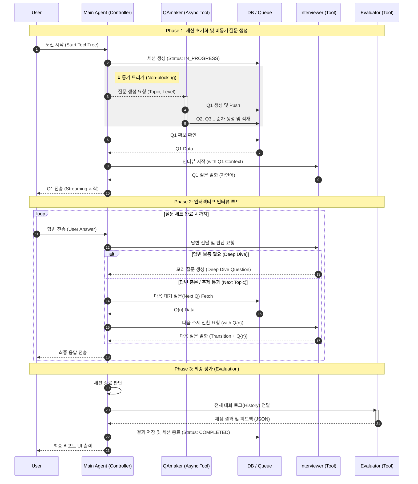

# Agent Workflow & System Design

- **[1. Overview](#1-overview)**
- **[2. Main-Sub Agent Architecture](#2-main-sub-agent-architecture)**
- **[3. Workflow Steps](#3-workflow-steps)**
- **[4. Prompt Engineering Strategy](#4-prompt-engineering-strategy)**
- **[5. Sequence Diagram](#5-sequence-diagram-mermaid)**

---

## 1. Overview
본 문서는 "AI TechTree" 시스템의 **Main-Sub Agent Architecture**를 정의합니다.
기존의 단일 에이전트 또는 평면적 멀티 에이전트 구조를 **Controller(Main Agent)** 와 **Specialized Workers(Sub-Agents)** 구조로 재편하여 확장성과 응답 속도를 극대화합니다.

참고: [LangChain Sub-agents Architecture](https://docs.langchain.com/oss/python/langchain/multi-agent/subagents)

---

## 2. Main-Sub Agent Architecture

시스템은 **Main Agent**가 사용자의 요청을 조율하고, 전문적인 작업은 **Sub-Agent**들을 **Tool**처럼 호출하여 수행하는 **Tool per Agent** 패턴을 따릅니다.

### 1. Main Agent (The Controller)
*   **Type**: Synchronous (동기식 처리)
*   **Role**: 사용자의 인터페이스이자 전체 워크플로우의 관리자.
*   **Responsibility**:
    *   사용자 요청 수신 및 의도 파악.
    *   적절한 Sub-Agent(Tool) 호출 및 실행 결과 중계.
    *   세션 상태 관리 및 에러 핸들링.

### 2. Sub-Agents (Specialized Tools)
각 Sub-Agent는 Main Agent가 필요에 따라 호출하는 **독립적인 기능 단위(Tool)**로 구현됩니다.

#### A. QAmaker Agent (Question Generator)
*   **Type**: **Asynchronous (비동기 백그라운드 처리)**
*   **Role**: 인터뷰 질문을 백그라운드에서 실시간으로 생성하여 대기열(Queue)에 적재.
*   **Features**:
    *   **Async Generation**: Main Agent가 인터뷰 시작 신호를 보내면, 사용자 대기 시간을 최소화하기 위해 백그라운드에서 즉시 다음 질문들을 하나씩 생성(One-by-one)합니다.
    *   **Output**: DB `questions` 후보군 적재.

#### B. Interviewer Agent (The Facilitator)
*   **Type**: Synchronous (Interactive)
*   **Role**: 사용자와 직접 대화하며 질문을 던지고 꼬리물기(Deep Dive)를 수행.
*   **Input**: `QAmaker`가 생성한 질문, `User Answer`
*   **Reference**: QAmaker가 만든 질문을 컨텍스트로 활용하지만, 상황(질문 수준)에 따라 유연하게 꼬리 질문을 생성.

#### C. Evaluator Agent (The Judge)
*   **Type**: Synchronous (One-Shot)
*   **Role**: 대화 로그를 기반으로 최종 평가 수행.

---

## 3. Workflow Steps

### Phase 1: 세션 초기화 및 비동기 질문 생성 (Init & Async Gen)
사용자가 도전을 시작하면 Main Agent는 즉시 응답 가능한 상태를 만들고, QAmaker를 백그라운드에서 가동합니다.

1.  **User**: 도전 시작 요청.
2.  **Main Agent**:
    *   세션 생성 (Status: `IN_PROGRESS`).
    *   **Tool Call (QAmaker)**: "Python Lv.2 질문 생성 시작해(비동기 Trigger)".
3.  **QAmaker (Async)**:
    *   첫 번째 필수 질문(Q1)을 즉시 생성하여 DB/Queue에 Push.
    *   이후 Q2, Q3를 백그라운드에서 순차적으로 생성 및 적재.
4.  **Main Agent**:
    *   질문 큐에서 Q1이 확보되는 즉시 **Interviewer Tool** 호출.

### Phase 2: 인터렉티브 인터뷰 (Tool-based Interaction)
Main Agent는 사용자의 입력을 받아 Interviewer Tool을 통해 적절한 답변을 생성합니다.

1.  **User**: 답변 전송.
2.  **Main Agent**:
    *   현재 대화 맥락을 파악.
    *   **Tool Call (Interviewer)**: 사용자의 답변을 전달하고 다음 발화 생성 요청.
3.  **Interviewer Tool**:
    *   **Deep Dive Logic**: 답변이 부족하면 꼬리 질문 생성.
    *   **Review Logic**: 답변이 충분하면 QAmaker가 만들어둔 **다음 질문(Q2)**을 Fetch하여 제시.
4.  **Main Agent**: Interviewer의 출력을 사용자에게 스트리밍.

### Phase 3: 평가 (Evaluation)
1.  **Main Agent**: 모든 질문 세트 완료 감지.
2.  **Tool Call (Evaluator)**: 전체 대화 로그 전달.
3.  **Evaluator Tool**: 채점 및 피드백 JSON 반환.
4.  **Main Agent**: 결과 저장 및 사용자에게 리포트 표시.

---

## 4. Prompt Engineering Strategy

*   **Main Agent Prompt**: "당신은 AI TechTree의 진행자입니다. 사용자의 요청이 들어오면 `QAmaker`, `Interviewer`, `Evaluator` 도구를 적절히 사용하여 과정을 진행하십시오."
*   **QAmaker Prompt**: "주어진 기술과 레벨에 맞는 날카로운 면접 질문을 하나씩 생성하십시오. JSON 형식으로 출력해야 합니다."
*   **Interviewer Prompt**: "당신은 면접관입니다. Main Agent가 제공한 Reference Question을 기반으로 대화를 진행하되, 너무 기계적으로 굴지 마십시오."

---

## 5. Sequence Diagram (Mermaid)

### 다이어그램 요약
1.  **Main Agent 중심 구조**: 모든 요청은 Main Agent를 통하며, Main Agent가 상황에 맞춰 하위 Sub-Agent(QAmaker, Interviewer)를 호출합니다.
2.  **Async QAmaker**: QAmaker는 Main Agent의 요청을 받으면 백그라운드(비동기)에서 질문을 하나씩 만들어 DB에 쌓아둡니다. 이를 통해 유저는 기다림 없이 인터뷰를 진행할 수 있습니다.
3.  **Tool Use**: Interviewer와 Evaluator는 독립적인 에이전트라기보다는, Main Agent가 사용하는 "능력(Tool)"으로써 동작합니다.

