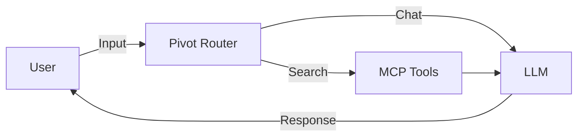
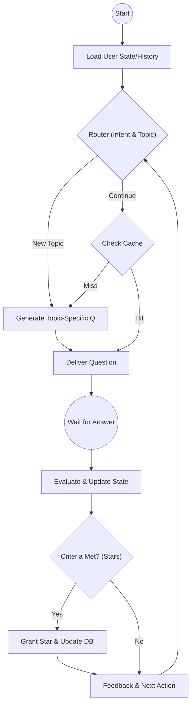
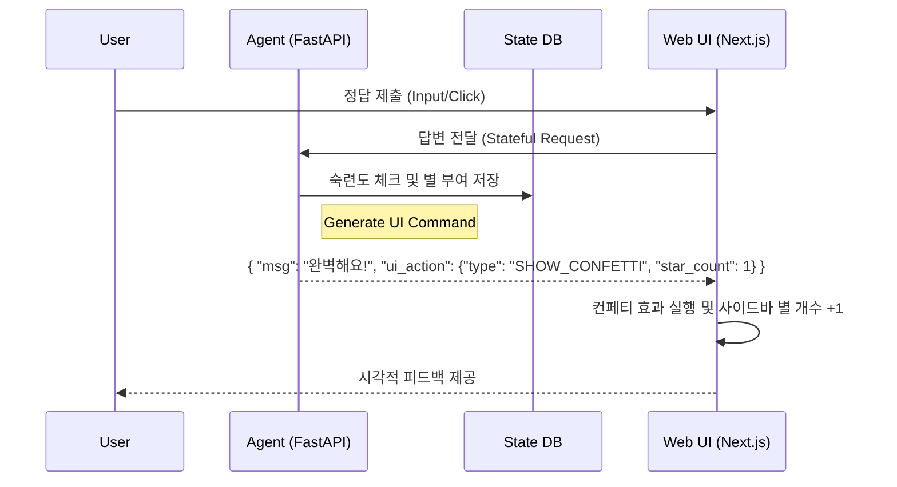

# AI Agent System Architecture (v1.1 Updated)
> 이 문서는 AI TechTree Agent의 진화 과정을 정의하며, 특히 v1.1의 상태 관리와 v2.0의 UI 상호작용 설계에 집중합니다.

### 📚 Index
- **[v1.0: MCP Chatbot (Stateless)](#v10-mcp-chatbot-stateless)** - 단순 정보 제공
- **[v1.1: Stateful Agent (Current)](#v11-stateful-agent-current)** - 실시간 상태 기반 면접관 (Router + Memory + Reward)
- **[v1.2: Optimization & Scale (Planned)](#v12-optimization--scale-planned)** - 비용 절감 및 RAG 기반 문제 생성
- **[v2.0: Interactive Web Service](#v20-interactive-web-service)** - UI 제어 및 시각적 경험(Confetti/Star) 강화

---

## v1.0: MCP Chatbot (Stateless)
> **"단순 질문 및 정보 검색"**
> 상태를 저장하지 않고, 사용자의 질문에 대해 MCP Tool을 호출하여 답변하는 1회성 봇입니다.

### 🕸️ Flow Architecture

---

## v1.1: Stateful Agent (Current)

> **"살아있는 면접관 (Dynamic Topic Switcher)"**
> 사용자의 학습 상태, 관심 분야, 숙련도를 기억하고 실시간으로 '별(Star)'을 부여하며 흐름을 제어합니다.

### 💡 Core Logic

1. **Context-Aware Router**: 사용자의 현재 세션 상태(학습 이력, 최근 정답률)를 분석해 다음 질문의 난이도나 분야를 유동적으로 결정합니다.
2. **Real-time State DB**:
* **User State**: 관심 분야, 현재 진행도, 취약점 저장.
* **Reward Logic**: 특정 유형에서 연속 정답 시 'Evaluator'가 별(Star) 부여 트리거를 발생시키고 DB에 즉시 기록.

3. **Topic Switcher**: 한 분야의 숙련도가 일정 수준에 도달하면 관련 있는 다음 기술 스택으로 자연스럽게 대화 주제를 전환합니다.

### 🕸️ Graph Flow (v1.1)

---

## v1.2: Optimization & Scale (Planned)

> **"RAG 기반 문제 재고 관리"**
> 오프라인 환경에서 고품질 문제를 생성해두고 실시간 응답 속도를 극대화합니다.

### 💡 Key Improvements

1. **RAG-Enhanced Generation**: '정보처리기사' 등 특정 도메인 지식 베이스를 참조하여 정확도 높은 문제를 생성.
2. **Offline Worker**: Batch API를 활용해 야간 시간에 사용자별 맞춤형 문제 풀을 미리 확보 (비용 50% 절감).

---

## v2.0: Interactive Web Service

> **"Agent as UI Controller (Protocol-Driven)"**
> 에이전트가 텍스트를 넘어 웹의 모든 시각 요소(별 획득 효과, 게이지)를 직접 제어합니다.

### 💡 UI Control Protocol (JSON Action)

에이전트는 모든 응답에 `ui_action` 객체를 포함하여 프론트엔드(Next.js)에 명령을 내립니다.

| Action Type | Description | UI Effect |
| --- | --- | --- |
| `SHOW_CONFETTI` | 별 획득 시 전체 화면에 폭죽 효과 발생 | 🎉 시각적 보상 제공 |
| `UPDATE_LEVEL` | 실시간 경험치/숙련도 게이지 상승 | 📊 성취도 시각화 |
| `SWITCH_LAYOUT` | 대화 주제 전환 시 배경 테마 또는 레이아웃 변경 | 🎨 몰입감 증대 |
| `TOAST_MESSAGE` | 상단 알림창으로 실시간 피드백 전달 | 🔔 빠른 정보 확인 |

### 🕸️ Interaction Sequence

---

### 🛠️ Integrated Infrastructure Tools (No-LLM Logic)
에이전트의 '정보 조회'를 넘어 '행동'과 '개인화'를 완성하는 핵심 도구셋입니다.

| 카테고리 | 도구 명칭 | 역할 및 기능 |
| :--- | :--- | :--- |
| **로드맵 탐색** | `get_next_recommend_node` | 사용자의 학습 이력과 로드맵을 비교하여 **다음에 공부할 최적의 과목**을 추출합니다. |
| **정보 검색** | `get_techtree_trend` | 외부 API를 통해 최신 기술 동향 데이터를 수집합니다. (기존 구현 완료) |
| **상태 관리** | `get_user_state` | 사용자의 현재 별(Star) 개수, 관심사, 진행도를 DB에서 호출합니다. |
| **보상 실행** | `grant_star_reward` | 특정 성취 달성 시 DB의 별 수치를 업데이트하고 성공 여부를 반환합니다. |
| **상태 동기화** | `sync_progress_state` | 학습 완료 및 면접 결과 등 사용자의 모든 활동 상태를 DB에 실시간 기록합니다. |
| **UI 제어** | `create_ui_action` | 폭죽(Confetti), 토스트, 프로그레스 바 제어를 위한 UI 명령 패킷을 생성합니다. |