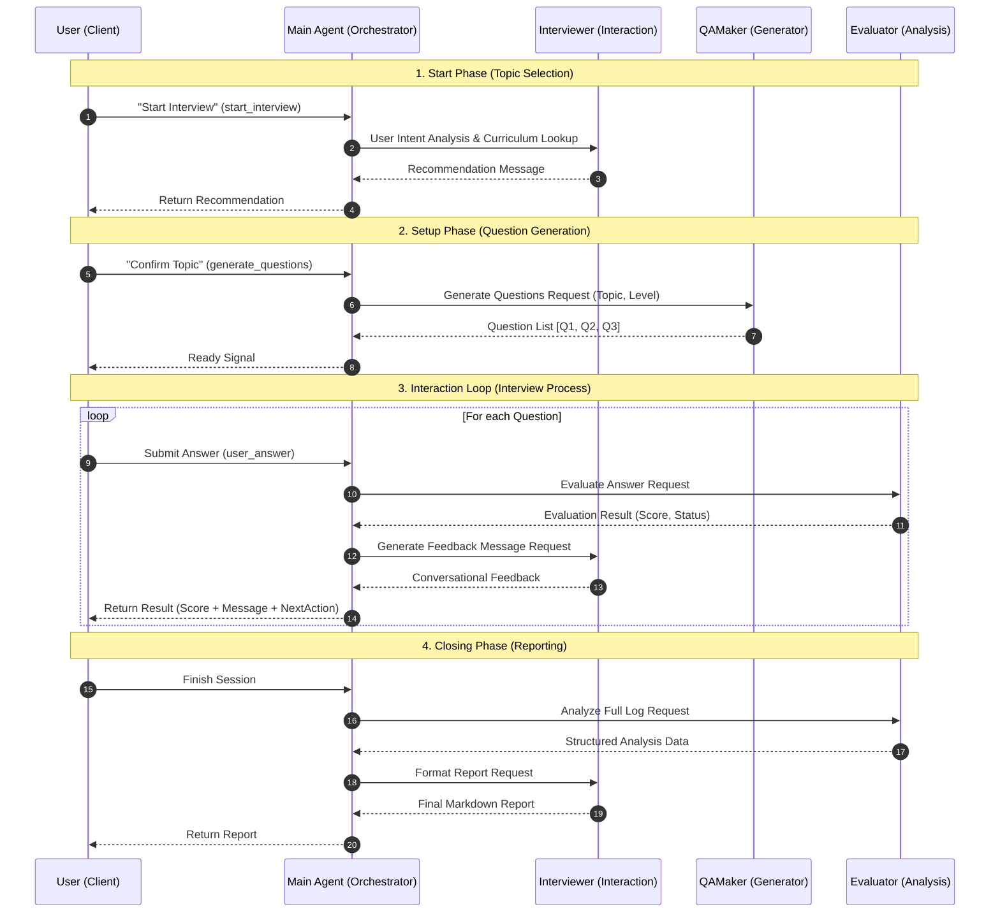

# AI Agent System Architecture

- **[1. Overview](#1-overview)**
- **[2. Agent Roles & Responsibilities](#2-agent-roles--responsibilities)**
- **[3. Detailed Tool Logic](#3-detailed-tool-logic)**
- **[4. Sequence Diagram](#4-sequence-diagram)**

---

## 1. Overview
본 문서는 **AI TechTree 서비스**의 핵심인 **AI Agent 시스템 아키텍처**를 정의합니다.
이 시스템은 **Stateless & Logic-Only** 원칙을 따르며, **Main Agent (Orchestrator)** 가 사용자 요청을 받아 적절한 **Sub-Agent (Expert)** 들을 도구(Tool)처럼 호출하여 면접 경험을 만듭니다.

### 핵심 철학
*   **Orchestration**: 모든 흐름 제어는 Main Agent가 담당하며, Sub-Agent는 서로를 직접 호출하지 않습니다.
*   **Deterministic**: 예측 불가능한 Tool Call 대신, 명확한 코드 로직(Code-Driven)으로 Agent를 제어하여 안정성을 확보합니다.
*   **Separation of Concerns**: 역할(사회자, 작가, 심판, 출제자)을 명확히 분리하여 유지보수성을 높입니다.

---

## 2. Agent Roles & Responsibilities

시스템은 1개의 **Main Agent**와 3개의 **Sub-Agent**로 구성됩니다.

### 👑 Main Agent (Orchestrator)
*   **역할**: 전체 워크플로우를 관리하고 제어하는 **중앙 관리자**.
*   **책임**:
    *   사용자 요청 의도 파악.
    *   적절한 하위 에이전트(Tool) 호출 및 데이터 중계(Routing).
    *   최종 결과물 조합 및 반환.
*   **특징**: 의사결정(Decision Making)과 흐름 제어(Flow Control)를 담당합니다.

### 🎭 Interviewer Agent (Interaction Handler)
*   **역할**: 사용자와의 상호작용 및 자연어 생성을 담당하는 **인터페이스 에이전트**.
*   **책임**:
    *   **커리큘럼 탐색**: 사용자의 관심사에 맞는 토픽 추천.
    *   **피드백 생성**: 건조한 평가 데이터를 사용자 친화적인 자연어 피드백으로 변환.
    *   **최종 리포트 포맷팅**: 분석 데이터를 구조화된 Markdown 리포트로 가공.
*   **특징**: 사용자 경험(UX)과 톤앤매너(Tone & Manner)를 관리합니다.

### ⚖️ Evaluator Agent (Analysis Engine)
*   **역할**: 답변을 분석하고 정량적/정성적 평가를 수행하는 **분석 에이전트**.
*   **책임**:
    *   **채점 (Scoring)**: 기술적 정확성, 논리성을 기준으로 점수 산출.
    *   **판정 (Decision)**: 기준 점수에 따른 통과/실패 여부 결정.
    *   **종합 분석**: 전체 대화 로그를 기반으로 강점 및 약점 추출.
*   **특징**: 객관적 사실에 기반한 정밀 분석을 수행합니다. (Temperature=0)

### 📚 QAMaker Agent (Question Generator)
*   **역할**: 커리큘럼 기반의 면접 질문을 생성하는 **생성 에이전트**.
*   **책임**:
    *   **문제 생성**: 특정 Topic/Level에 적합한 기술 면접 질문 생성.
    *   **다양성 확보**: 중복되지 않는 다양한 유형의 질문 세트 제공.
*   **특징**: AI TechTree의 기술셋(Skillset) 정의를 준수합니다.

---

## 3. Detailed Tool Logic

웹 서비스 및 외부 클라이언트가 호출할 수 있는 **전용 도구(Service Tools)**입니다.

### 🔵 1. 면접 시작 및 주제 추천 (`start_interview`)
*   **Flow**: `User` -> `Main` -> `Interviewer` (의도 파악 및 커리큘럼 조회) -> `Main`
*   **입력**: `user_input` (String)
*   **출력**: 추천 멘트 (String)
*   **설명**: 모호한 사용자 요청을 구체적인 **면접 주제(Topic)**로 변환 및 제안합니다.

### 🔵 2. 문제 생성 (`generate_questions`)
*   **Flow**: `Main` -> `QAMaker` (다중 문제 생성) -> `Main`
*   **입력**: `topic`, `level`, `count`
*   **출력**: 질문 리스트 (JSON List)
*   **설명**: 실시간으로 중복 없는 기술 면접 질문 세트를 생성합니다.

### 🔵 3. 답변 평가 및 피드백 (`evaluate_answer`)
*   **Flow**:
    1.  `Main` -> `Evaluator`: 답변 **채점** 요청 (Score, Pass/Fail).
    2.  `Main` -> `Interviewer`: 채점 결과를 바탕으로 **피드백 멘트** 작성 (Conversational Response).
    3.  `Main`: `next_action` (PASS/DEEP_DIVE) 결정 후 반환.
*   **입력**: `question`, `user_answer`, `level`
*   **출력**:
    *   `score` (Int)
    *   `feedback_message` (String)
    *   `next_action` (Enum)

### 🔵 4. 종합 리포트 (`summarize_result`)
*   **Flow**:
    1.  `Main` -> `Evaluator`: 로그 **종합 분석** (강점/약점 데이터 추출).
    2.  `Main` -> `Interviewer`: 분석 데이터를 **Markdown 리포트**로 변환.
*   **입력**: `conversation_history` (List)
*   **출력**: 최종 리포트 (Markdown String)

---

## 4. Sequence Diagram

