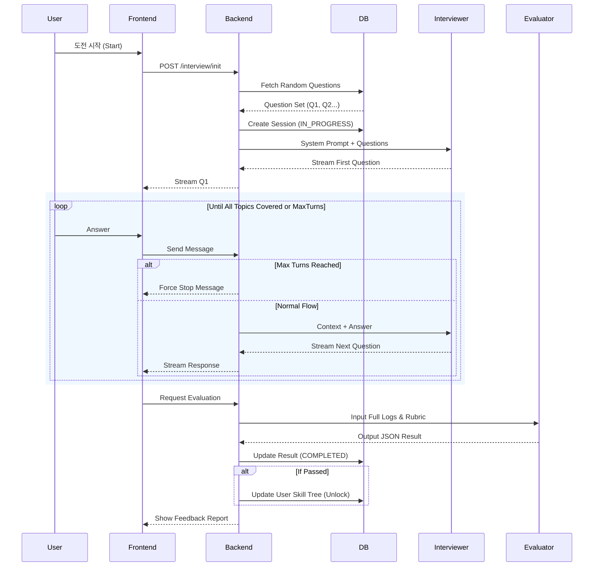

# Agent Workflow & System Design

- **[1. Overview](#1-overview)**
- **[2. Multi-Agent Architecture](#2-multi-agent-architecture)**
- **[3. Workflow Steps](#3-workflow-steps)**
- **[4. Prompt Engineering Strategy](#4-prompt-engineering-strategy)**
- **[5. Sequence Diagram](#5-sequence-diagram-mermaid)**

---

## 1. Overview
본 문서는 "AI TechTree" 시스템의 핵심인 **AI 에이전트 워크플로우**를 정의합니다.
사용자의 실력을 진단하는 **면접관**과 이를 평가하는 **채점관**의 멀티 에이전트 상호작용 및 데이터 흐름을 상세히 기술합니다.

---

## 2. Multi-Agent Architecture

시스템은 역할이 명확히 분리된 두 개의 에이전트가 협업하는 구조입니다.

### 1. Interviewer Agent (면접관)
*   **Role**: 사용자에게 기술 질문을 던지고, 답변에 따라 심층 질문(꼬리물기)을 수행합니다.
*   **Persona**: 직무 및 레벨에 따라 태도가 달라짐 (예: 1레벨은 친절한 사수, 3레벨은 깐깐한 시니어/임원).
*   **Input**: `Skill Context`, `Target Level`, `User Answer History`
*   **Output**: `Next Question` (Streamed Text) or `[END]` token

### 2. Evaluator Agent (채점관)
*   **Role**: 축적된 대화 데이터를 분석하여 합격 여부를 판단하고 피드백을 생성합니다.
*   **Constraint**: 사용자와 직접 대화하지 않으며, 오직 **데이터만**을 보고 냉정하게 평가합니다.
*   **Input**: `Full Chat History`, `Evaluation Rubric`
*   **Output**: `Assessment Result` (Structured JSON)

---

## 3. Workflow Steps

### Phase 1: 면접 세션 초기화 (Session Init)
사용자가 특정 노드(예: Python)의 승급 심사(예: 2차 전직)에 도전합니다.

1.  **Frontend**: `POST /api/interview/start` 요청 (skill: `python`, level: `2`).
2.  **Backend (Question Retrieval)**:
    *   DB `questions` 컬렉션에서 해당 기술/레벨의 **질문 세트(2~3개)를 랜덤 추출**합니다.
    *   (예: Generator, GIL, Decorator 주제 관련 질문 로드)
3.  **Backend (Session Create)**:
    *   DB `interviews` 컬렉션에 문서 생성 (`status`: `IN_PROGRESS`).
    *   **Interviewer Agent**에게 `System Prompt`와 함께 **추출된 질문 목록(Reference Questions)**을 전송합니다.
4.  **Interviewer Agent**:
    *   첫 번째 질문을 선택하여 **스트리밍**으로 사용자에게 전송.

### Phase 2: 실시간 문답 (Interactive Q&A)
사용자와 Interviewer Agent 간의 턴제 대화가 진행됩니다. (기본 5~10턴 내외)

**핵심 로직: Sequential Deep Dive (순차적 심층 검증)**
AI 면접관은 전달받은 **질문 세트(Q1, Q2, Q3)**를 **순서대로 진행**하며, 각 주제마다 충분한 깊이의 검증을 거칩니다.

1.  **User**: 답변 입력 및 전송.
2.  **Backend**: `current_turn` 및 대화 로그 전달.
3.  **Interviewer Agent (Decision Step)**:
    *   **Current Topic Check**: 현재 다루고 있는 주제(예: Q1)에 대한 답변을 분석.
    *   **Loop A (Deep Dive)**: 답변이 부족하거나 검증이 필요하면 -> **꼬리물기 질문(Follow-up) 유지**.
    *   **Loop B (Topic Switch)**: 현재 주제가 통과(Pass)되었다고 판단되면 -> **"좋습니다. 다음은 [Q2 주제]에 대해 질문하겠습니다."라며 다음 질문 제시**.
    *   *전체 흐름: [Q1 질문 -> 꼬리질문 -> 통과] ➡️ [Q2 질문 -> 꼬리질문 -> 통과] ➡️ [Q3 질문 ...]*
4.  **Termination Logic (Hard Limit)**:
    *   **Condition A**: 준비된 모든 질문 세트(Q1~Q3)가 완료되면 `[END]` 토큰 출력.
    *   **Condition B**: `MAX_TURN_COUNT` 도달 시 강제 종료.

### Phase 3: 평가 및 피드백 (Evaluation)
면접이 종료되면 Evaluator Agent가 개입하여 One-Shot 평가를 수행합니다.

1.  **Backend**: 전체 대화 로그(`messages`)를 **Evaluator Agent** 프롬프트에 주입.
2.  **Evaluator Agent Processing**:
    *   사전에 정의된 **세부 평가 기준(Rubric)**에 따라 각 항목 점수 산출.
    *   **Decision Making**: 총점 80점 이상 시 Pass 처리.
3.  **JSON Generation**:
    ```json
    {
      "is_passed": true,
      "total_score": 85,
      "criteria_scores": {
        "technical_accuracy": 90,   // 기술적 정확성
        "logical_consistency": 80,  // 논리적 일관성
        "practical_application": 85 // 실무 응용 능력
      },
      "feedback_summary": "핵심 개념인 Yield의 동작 원리를 정확히 이해하고 있습니다.",
      "improvement_guide": "비동기 Generator(async for)에 대한 개념도 추가로 학습하면 완벽할 것입니다."
    }
    ```
4.  **System Action**:
    *   DB `interviews` 문서 업데이트 (결과 저장, `status`: `COMPLETED`).
    *   **If Passed**: `users` 컬렉션 업데이트 -> **Skill Level Up & Star Earned!**
    *   Frontend 결과 리포트 반환.

---

## 4. Prompt Engineering Strategy

### Level-Adaptive Prompting
도전 레벨에 따라 에이전트의 난이도와 평가 기준을 동적으로 조절합니다.

| Level | Interviewer Persona | Evaluator Criteria |
| :--- | :--- | :--- |
| **Lv.1 (Basic)** | 친절하고 유도적인 질문 (Junior Mentor) | **Accurarcy**: 용어와 정의를 틀리지 않았는가? |
| **Lv.2 (Applied)** | 실무 중심의 해결책 요구 (Team Lead) | **Problem Solving**: 코드로 구현 가능하고 현실적인가? |
| **Lv.3 (Advanced)** | 트레이드오프와 설계 중심 (CTO) | **Architecture**: 확장성과 유지보수성을 고려했는가? |

### Guardrails & Safety
*   **Turn Limit**: 무한 루프 방지를 위해 백엔드 하드 코딩된 `MAX_TURNS` 적용.
*   **Strict JSON Mode**: LLM 설정(temperature=0, json_mode=on)을 통해 반드시 파싱 가능한 JSON만 출력하도록 강제.

---

## 5. Sequence Diagram (Mermaid)



### 다이어그램 요약 설명
위 다이어그램은 **면접 시작부터 결과 처리까지의 전체 흐름**을 보여줍니다.

1.  **시작 단계 (Init)**: 유저가 도전을 시작하면 시스템이 DB에서 질문을 꺼내와 면접관 AI에게 전달하고 면접을 시작합니다.
2.  **대화 단계 (Loop)**: 유저와 면접관 AI가 대화를 주고받습니다. 답변이 부족하면 꼬리 질문을 하고, 충분하면 다음 주제로 넘어갑니다.
3.  **평가 단계 (Evaluation)**: 모든 대화가 끝나면 채점관 AI가 대화 로그를 정밀 분석하여 합격/불합격을 판정하고 피드백을 줍니다. 합격 시 스킬 트리가 업데이트됩니다.

### 다이어그램 보는 법 (Legend)

다이어그램을 구성하는 **기호(선, 박스)**와 **주요 용어**에 대한 설명입니다.

#### 1. 기호와 도형 (Symbols)
| 기호 (Symbol) | 의미 (Meaning) | 설명 (Description) |
| :--- | :--- | :--- |
| **실선 화살표** (`──▶`) | **요청 (Request)** | "이거 처리해줘" 또는 "데이터 받아라" 하고 명령을 보낼 때 사용합니다. (예: 시작 요청) |
| **점선 화살표** (`--▶`) | **응답 (Response)** | "작업 끝났어, 결과는 이거야" 하고 답장을 보낼 때 사용합니다. |
| **상단 네모 칸** | **참여자 (Participant)** | 작업을 수행하는 주체들입니다. (User=사용자, Backend=서버, AI=지능형 에이전트) |
| **loop 박스** | **반복 (Loop)** | 특정 조건이 끝날 때까지 질문과 답변을 계속 주고받는 구간입니다. |
| **alt 박스** | **선택 (Alternative)** | 상황에 따라 "강제 종료" 또는 "정상 진행"으로 흐름이 갈라지는 구간입니다. |

#### 2. 화살표 위 주요 용어 (Terms)
| 용어 | 설명 |
| :--- | :--- |
| **System Prompt** | AI 면접관에게 "너는 면접관이야"라고 역할을 부여하는 초기 설정값 |
| **Question Set** | 면접 진행을 위해 DB에서 꺼내온 질문 꾸러미 |
| **Stream** | 타자 치듯 글자가 실시간으로 나오는 전송 방식 |
| **Rubric** | 채점관 AI가 합격 여부를 판단할 때 사용하는 채점 기준표 |
