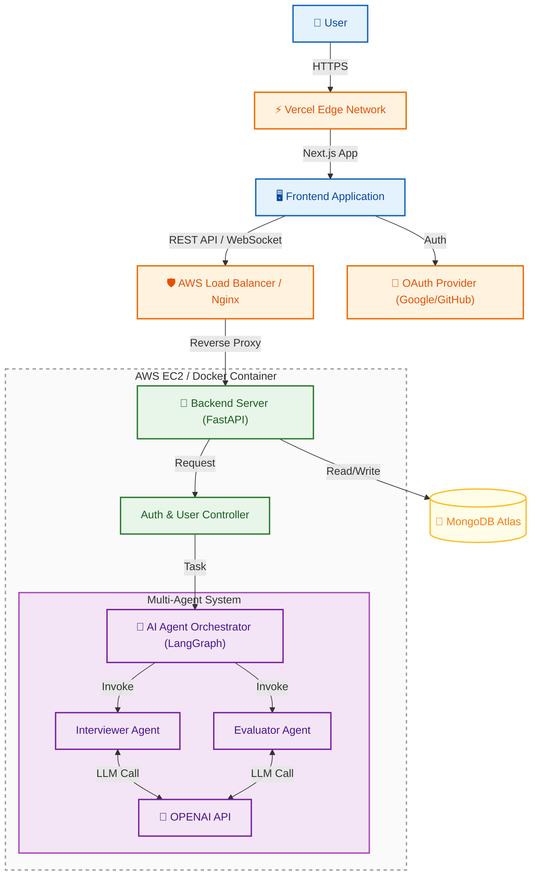

# 시스템 아키텍처 (System Architecture)

> **AI TechTree** 서비스의 기술 구조와 배포 환경을 정의한 문서입니다.
> 초기에는 단일 서버(Monolithic)로 빠르게 개발하되, AI 기능은 모듈화하여 추후 서비스 확장(Microservice 전환)에 유연하게 대비합니다.

1.  [High-Level Architecture](#high-level-architecture)
2.  [Architecture Components & Data Flow](#architecture-components--data-flow)
3.  [Security & Standards](#security--standards)
4.  [Glossary](#glossary)

---

## High-Level Architecture

| 색상 (Color) | Layer | 구성 요소 (Components) |
| :---: | :--- | :--- |
| 🔵 | **Frontend** | User, Client Application |
| 🟢 | **Backend** | FastAPI Server, Controller |
| 🟣 | **AI Services** | LangGraph Orchestrator, AI Agents, LLM |
| 🟠 | **Infrastructure** | CDN, Load Balancer, OAuth |
| 🟡 | **Database** | MongoDB Atlas |

---
## Architecture Components & Data Flow

이 아키텍처는 사용자 경험을 최적화하고 AI 에이전트 간의 효율적인 협업을 지원하기 위해 설계되었습니다. 주요 구성 요소와 흐름은 다음과 같습니다.

1.  **`클라이언트 (Frontend Layer)`**
    *   **Vercel & Next.js**: Vercel Edge Network 배포, SSR 기반 빠른 로딩 속도 확보.
    *   **Interactive**: REST API/WebSocket 실시간 통신, OAuth(Google, GitHub) 인증 지원.

2.  **`백엔드 및 인프라 (Backend Layer)`**
    *   **FastAPI & Docker**: AWS EC2 내 Docker 컨테이너 실행, Python 비동기 고성능 처리.
    *   **Gateway**: AWS Load Balancer/Nginx 리버스 프록시, 트래픽 분산 및 보안 강화.

3.  **`AI 에이전트 오케스트레이션 (AI Core)`**
    *   **LangGraph Orchestrator**: AI 작업 흐름 제어, 상태 관리 및 에이전트 간 통신 조율.
    *   **Multi-Agent System**:
        *   **Interviewer Agent**: 사용자 질의-응답 인터랙션 및 상황 주도.
        *   **Evaluator Agent**: 답변 분석, 기술 수준 평가 및 피드백 생성.
    *   **LLM Integration**: OpenAI API 호출을 통한 지능적 데이터 처리.

4.  **`데이터 계층 (Data Layer)`**
    *   **MongoDB Atlas**: 유연한 NoSQL 스키마, 사용자 프로필/스킬 트리/로그 관리 (Cloud).

---
## Security & Standards

*   **인증/인가**: JWT (Access/Refresh Token) 기반 Stateless 인증.
*   **보안**: 민감 정보(API Key, DB URI)는 서버 환경 변수(.env)로 관리.
*   **기술 스택**:
    *   **FE**: Next.js 14+ (App Router), TypeScript 5.x
    *   **BE**: Python 3.11+, FastAPI, Pydantic v2

---
## Glossary

| 용어 (Term) | 설명 (Description) |
| :--- | :--- |
| **Monolithic & AI Modules** | 단일 서버로 빠른 개발 지향, AI 기능만 모듈화하여 추후 분리 용이성 확보. |
| **Microservice** | 작은 독립적인 서비스들로 구성되어 각 서비스가 특정 기능을 수행하는 아키텍처. |
| **Vercel Edge Network** | 전 세계 분산 서버망 활용, 사용자 위치 기반 최적 속도 제공. |
| **SSR (Server-Side Rendering)** | 서버에서 화면을 미리 그려 전송, 초기 로딩 속도 및 SEO 최적화. |
| **Reverse Proxy** | 클라이언트의 요청을 대신 받아 내부 서버로 전달하는 보안 및 부하 분산 서버. |
| **LangGraph** | 다중 AI 에이전트 간 대화 흐름 및 작업 순서를 제어하는 오케스트레이터. |
| **JWT (JSON Web Token)** | 유저 인증 정보를 담은 암호화된 토큰으로, 서버가 세션을 저장하지 않고도(Stateless) 인증 가능. |
| **MongoDB Atlas** | 유연한 JSON 문서 저장 방식의 클라우드 데이터베이스 (Schema-less). |

