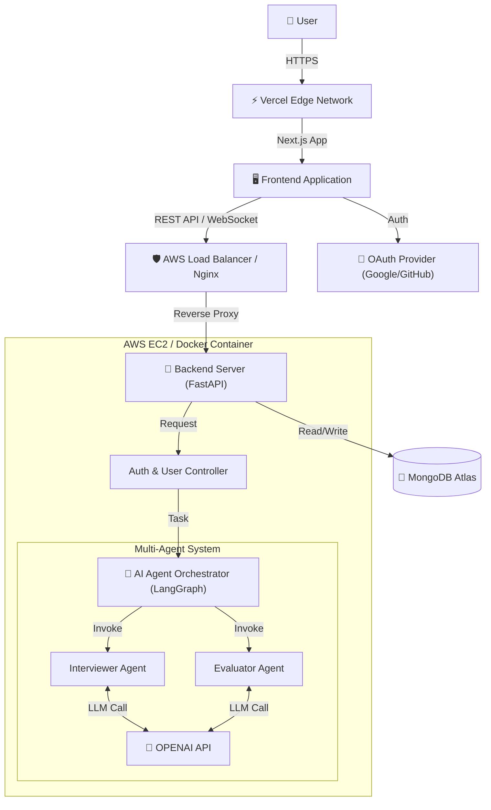

# 🏗 시스템 아키텍처 (System Architecture)

> **AI TechTree** 서비스의 전체적인 기술 구조와 데이터 흐름, 배포 환경을 정의한 문서입니다.
> MSA(Microservices Architecture)를 지향하되, 초기 단계에서는 **Monolithic + AI Modules** 형태로 효율성을 추구합니다.

---

## 1. High-Level Architecture

사용자(Client)가 웹 애플리케이션에 접속하여 AI 에이전트와 상호작용하는 전체 구조도입니다.

---

## 2. Technology Stack

각 계층별 핵심 기술 스택과 선정 이유는 다음과 같습니다.

### 🎨 Frontend (Client Side)
- **Framework**: `Next.js 15+` (App Router)
  - SSR/CSR 하이브리드 렌더링을 통한 초기 로딩 속도 최적화 및 SEO 강화.
- **Language**: `TypeScript`
- **Styling**: `Tailwind CSS` (혹은 CSS Modules)
- **Deployment**: `Vercel`
  - Git Push 자동 배포 및 Edge Network 활용.

### ⚙️ Backend (Server Side)
- **Framework**: `FastAPI` (Python)
  - 비동기 처리(Async/Await)에 강하며, AI 라이브러리(LangChain)와의 호환성이 뛰어남.
- **Runtime**: `Docker` Container
- **Infrastructure**: `AWS EC2` (t3.small or medium)
- **API Docs**: Swagger UI (Auto-generated)

### 🤖 AI Engine (Core Logic)
- **Orchestration**: `LangGraph` & `LangChain`
  - 상태 기반의 복잡한 멀티 에이전트 흐름(인터뷰 -> 평가 -> 피드백) 제어.
- **LLM**: `OpenAI GPT-4o` / `GPT-4o-mini`
  - 고성능 추론 및 JSON 포맷팅 최적화.

### 💾 Database (Data Layer)
- **Main DB**: `MongoDB Atlas` (Cloud)
  - **NoSQL**: 유연한 스키마 구조로, 비정형 데이터인 '채팅 로그'와 '스킬 트리' 구조 저장에 적합.
  - **ODM**: `Beanie` or `Motor` (Python Async Driver).

---

## 3. Detailed Component design

### 3.1. Frontend Layer
- **Pages**: 랜딩, 대시보드(스킬 트리), 인터뷰 룸, 결과 리포트.
- **State Management**: React Query (Server State), Zustand (Client State).
- **Communication**: 
  - 기본 데이터 통신: HTTP REST API.
  - 실시간 채팅(인터뷰): WebSocket or Server-Sent Events (SSE).

### 3.2. Backend & AI Layer
- **API Gateway**: 인증(Authentication) 및 라우팅 처리.
- **Agent Service**:
  - **Interviewer**: 질문 생성, 사용자 답변 분석, 꼬리 질문 유도.
  - **Evaluator**: 인터뷰 종료 후 전체 대화 맥락 분석, 점수 산정, 피드백 생성.
- **Service Layer**: 비즈니스 로직 처리 (유저 레벨업, 경험치 획득 등).

### 3.3. Database Schema Concept
- **Users**: 계정 정보, 현재 티어, 전체 진행도.
- **SkillTrees**: 기술 노드 구조, 달성 조건.
- **Interviews**: 세션 정보, 대화 로그(Message History), 평가 결과.
- **QuestionBank**: 사전에 정의된 핵심 질문 및 평가 기준 템플릿.

---

## 4. Deployment Pipeline (CI/CD)

### Frontend (Vercel)
1. **GitHub Main Push** → 2. **Vercel Build** → 3. **Deploy to Production**

### Backend (AWS + Docker)
1. **Local Development**: `docker-compose up` 으로 DB 및 서버 실행 테스트.
2. **Build**: `Dockerfile` 기반 이미지 빌드.
3. **Deploy**:
   - (초기) EC2 접속 후 `git pull` & `docker-compose up --build`.
   - (고도화) GitHub Actions → AWS ECR → EC2 자동 배포.

---

## 5. Security & Scalability

- **Environment Variables**: API Key, DB URI 등은 `.env` 파일로 관리하며 리포지토리에 포함하지 않음.
- **CORS**: 프론트엔드 도메인(Vercel)에서의 요청만 허용.
- **Scalability**: Stateless한 백엔드 구조로 설계하여, 향후 트래픽 증가 시 EC2 Auto Scaling 적용 가능.
