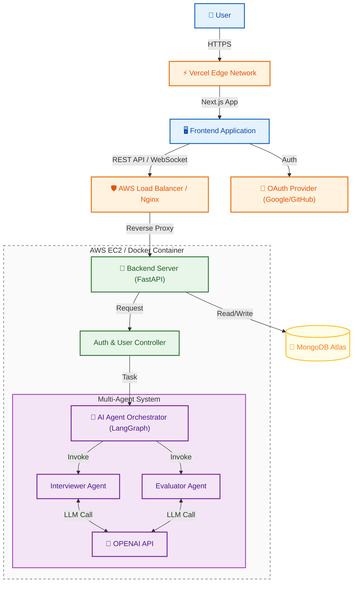

# 시스템 아키텍처 (System Architecture)

> **AI TechTree** 서비스의 전체적인 기술 구조와 데이터 흐름, 배포 환경을 정의한 문서입니다.
> MSA(Microservices Architecture)를 지향하되, 초기 단계에서는 **Monolithic + AI Modules** 형태로 효율성을 추구합니다.

---

## 💡 High-Level Architecture

## 💡 아키텍처 구성 요소 및 데이터 흐름 설명

이 아키텍처는 사용자 경험을 최적화하고 AI 에이전트 간의 효율적인 협업을 지원하기 위해 설계되었습니다. 주요 구성 요소와 흐름은 다음과 같습니다.

1.  **`클라이언트 (Frontend Layer)`**
    *   **Vercel & Next.js**: 사용자는 Vercel Edge Network를 통해 배포된 Next.js 애플리케이션에 접속합니다. 이를 통해 빠른 로딩 속도와 SSR(Server-Side Rendering)의 이점을 활용합니다.
    *   **상호작용**: 클라이언트는 REST API 및 WebSocket을 통해 백엔드와 실시간으로 통신하며, OAuth Provider(Google, GitHub)를 통해 안전한 로그인 기능을 제공합니다.

2.  **`백엔드 및 인프라 (Backend Layer)`**
    *   **FastAPI & Docker**: Python 기반의 FastAPI 서버가 AWS EC2 상의 Docker 컨테이너 내에서 실행됩니다. 이는 높은 성능과 비동기 처리 능력을 보장합니다.
    *   **Gateway**: AWS Load Balancer 또는 Nginx가 리버스 프록시 역할을 수행하여 트래픽을 분산하고, 백엔드 서버로 요청을 안전하게 전달합니다.

3.  **`AI 에이전트 오케스트레이션 (AI Core)`**
    *   **LangGraph Orchestrator**: 복잡한 AI 작업을 관리하는 중앙 제어 장치입니다. 작업의 흐름을 정의하고, 상태를 관리하며 에이전트 간의 통신을 조율합니다.
    *   **Multi-Agent System**:
        *   **Interviewer Agent**: 사용자에게 질문을 던지고 응답을 이끌어내는 역할을 수행합니다.
        *   **Evaluator Agent**: 사용자의 응답을 분석하여 기술 수준을 평가하고 피드백을 생성합니다.
    *   이들은 OpenAI API(LLM)를 호출하여 지능적인 처리를 수행합니다.

4.  **`데이터 계층 (Data Layer)`**
    *   **MongoDB Atlas**: 스키마 유연성이 높은 NoSQL 데이터베이스인 MongoDB를 사용하여 사용자 프로필, 대화 로그, 스킬 트리 정보를 저장하고 관리합니다. Cloud 호스팅을 통해 데이터의 가용성과 확장성을 확보합니다.

## 🔒 보안 및 기술 표준 (Security & Standards)

*   **인증/인가**: JWT (Access/Refresh Token) 기반의 Stateless 인증 방식을 사용합니다.
*   **환경 변수**: 모든 민감 정보(API Key, DB URI)는 서버 환경 변수로 관리하며 코드에 노출하지 않습니다.
*   **기술 버전**:
    *   **Frontend**: Next.js 14+ (App Router), TypeScript 5.x
    *   **Backend**: Python 3.11+, FastAPI, Pydantic v2

## 💡 주요 용어 한 줄 설명 (Glossary)

| 용어 (Term) | 설명 (Description) |
| :--- | :--- |
| **Monolithic &  AI Modules** | 초기에는 하나의 서버로 빠르고 간편하게 개발하되, 복잡한 AI 기능은 나중에 떼어내기 좋게 블록처럼 따로 정리해두는 개발 전략입니다. |
| **Vercel Edge Network** | 전 세계에 퍼져 있는 서버망을 이용해, 유저가 어디에 있든 가장 가까운 곳에서 웹사이트를 빨리 보여주는 기술입니다. |
| **SSR (Server-Side Rendering)** | 브라우저가 아니라 서버에서 미리 화면을 다 그려서 보내주는 방식으로, 첫 로딩이 빠르고 검색 엔진에 잘 잡힙니다. |
| **LangGraph** | 여러 AI(에이전트)들이 서로 대화하거나 순서대로 일을 처리하도록 지휘하고 관리하는 'AI 작업 반장' 도구입니다. |
| **MongoDB Atlas** | 데이터를 고정된 표 형식이 아닌 유연한 문서 형태(JSON)로 저장하여, 구조 변경이 잦은 개발에 유리한 클라우드 데이터베이스입니다. |
