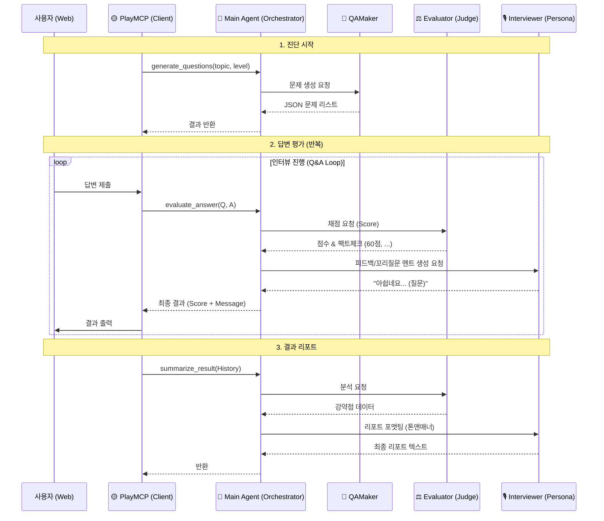

# TechTree Nexus: Kakao PlayMCP Edition

> **Target**: Kakao MCP Player 10 Contest  
> **Concept**: PlayMCP 채팅창에서 만나는 **"내 손안의 AI 기술 면접관"** (Logic-Only Version)

## 1. 아키텍처 (어떻게 연결되는가?)

본 MCP 서버는 **Stateless & Logic-Only** 아키텍처를 지향합니다.
복잡한 DB 연결이나 상태 관리는 최소화하고, **순수 AI 모델의 능력(생성, 판단, 분석)** 을 함수 형태로 제공하여 PlayMCP 클라이언트가 이를 조립해 사용할 수 있도록 합니다.

---

## 2. PlayMCP 연동 필수 조건

1.  **통신 방식**: `SSE (Server-Sent Events)` over HTTP
    *   로컬 전용(`stdio`)이 아닌 **웹 서버 모드**로 띄워야 함.
2.  **엔드포인트**:
    *   `http://{MY_PUBLIC_IP}:8000/sse` (MCP 접속 주소)
    *   `http://{MY_PUBLIC_IP}:8000/messages` (메시지 처리)
3.  **배포 환경**:
    *   **AWS EC2** (t2.micro 등) 사용.
    *   **DB 불필요**: 내부 저장소를 사용하지 않거나, 메모리 내 임시 저장만 수행.

---

## 3. 핵심 도구 (MCP Tools - Pure Logic)

이 서버는 데이터를 저장하지 않습니다. **`Main Agent`** 가 **PD(Producer)** 로서 전체 흐름을 조율하고, 각 전문 에이전트에게 작업을 지시하여 최종 결과물을 생성합니다.

### 🟡 Agent 역할 정의 (R&R)
1.  **Main Agent (PD)**: 사용자 요청을 수신, 하위 에이전트(`Interviewer`, `Evaluator`, `QAMaker`) 호출 및 결과 조립, 최종 응답 반환.
2.  **Interviewer Agent (MC/Writer)**: 사용자에게 전달할 **대화 텍스트(멘트)** 작성, 페르소나(친절함/냉철함) 유지, 꼬리 질문 생성.
3.  **Evaluator Agent (Judge)**: 답변의 기술적 정확성 채점, 합불 여부 판단 (감정 없는 팩트 체크).
4.  **QAMaker Agent (Bank)**: 주제별 문제 출제 (JSON 데이터 생성).

---

### 🟡 도구 상세 로직

#### 🔵 1. 면접 시작 및 주제 추천 (`start_interview`)
*   **Flow**: `Main` -> `Interviewer` (의도 파악 및 커리큘럼 조회) -> `Main` (추천 멘트 반환)
*   **설명**: 사용자의 첫 인사나 모호한 요청(예: "면접 볼래")을 분석하여 적합한 면접 주제(Track/Tier)를 제안합니다.
*   **입력**: `user_input` (String)
*   **출력**: 추천 멘트 w/ 커리큘럼 요약 (String)

#### 🔵 2. 문제 생성 (`generate_questions`)
*   **Flow**: `Main` -> `QAMaker` (문제 생성) -> `Main` (반환)
*   **설명**: 특정 주제와 난이도에 맞는 면접 질문을 즉석에서 생성합니다.
*   **입력**: `topic`, `level`, `count`
*   **출력**: 질문 리스트 (JSON)

#### 🔵 3. 답변 평가 및 피드백 (`evaluate_answer`)
*   **Flow**: 
    1. `Main` -> `Evaluator`: 답변 채점 요청 (Score, Pass/Fail, Missing Points 반환)
    2. `Main` -> `Interviewer`: 채점 결과를 바탕으로 **피드백 멘트 및 꼬리 질문** 작성 요청 (Persona 반영)
    3. `Main`: 최종 결과 조립 (`score` + `message` + `next_action`) 후 반환
*   **설명**: 사용자의 답변을 평가하고, 면접관의 페르소나를 담은 자연스러운 피드백을 제공합니다.
*   **입력**: `question`, `user_answer`, `level`
*   **출력**: 
    *   `score`: 점수 (0~100)
    *   `is_pass`: 통과 여부
    *   `feedback_message`: 사용자에게 보여줄 면접관의 말 (String)
    *   `next_action`: `PASS` (다음 문제) or `DEEP_DIVE` (꼬리 질문)

#### 🔵 4. 종합 리포트 (`summarize_result`)
*   **Flow**: `Main` -> `Evaluator` (분석) -> `Interviewer` (리포트 톤앤매너 정제) -> `Main`
*   **설명**: 전체 인터뷰 기록을 분석하여 강점/약점 및 향후 학습 가이드를 포함한 리포트를 작성합니다.
*   **입력**: `conversation_history`
*   **출력**: 종합 리포트 (Markdown)

---

## 4. 최종 목표 (시나리오)

> **심사위원**: "나 AI 개발자 실력 테스트 해볼래."
>
> **PlayMCP (Client)**: *(내부적으로 `generate_questions` 호출)*
> **TechTree(MCP)**: *("AI", "Lv.2" 입력받아 질문 생성 후 반환)*
>
> **PlayMCP**: "첫 번째 질문입니다. **Overfitting(과적합)이 발생했을 때...**"
>
> **심사위원**: "데이터 추가, Dropout 사용..."
>
> **PlayMCP**: *(내부적으로 `evaluate_answer` 호출)*
> **TechTree(MCP)**: *("정확합니다. 점수 90점..." 반환)*
>
> ... (반복) ...
>
> **PlayMCP**: *(모든 로그를 모아서 `summarize_result` 호출)*
> **TechTree(MCP)**: *("Lv.3 실전형 엔지니어..." 리포트 작성)*
> **PlayMCP**: "수고하셨습니다! 결과는 다음과 같습니다..."

---

## 5. 개발 체크리스트

- [ ] `FastAPI` + `LangChain` 기반의 Logic Server 구축.
- [ ] **No DB**: 데이터베이스 연결 코드 제거 (Stateless).
- [ ] AWS EC2 배포 및 Public IP 설정.
- [ ] 각 Tool(`generate`, `evaluate` 등)에 대한 프롬프트 최적화.
