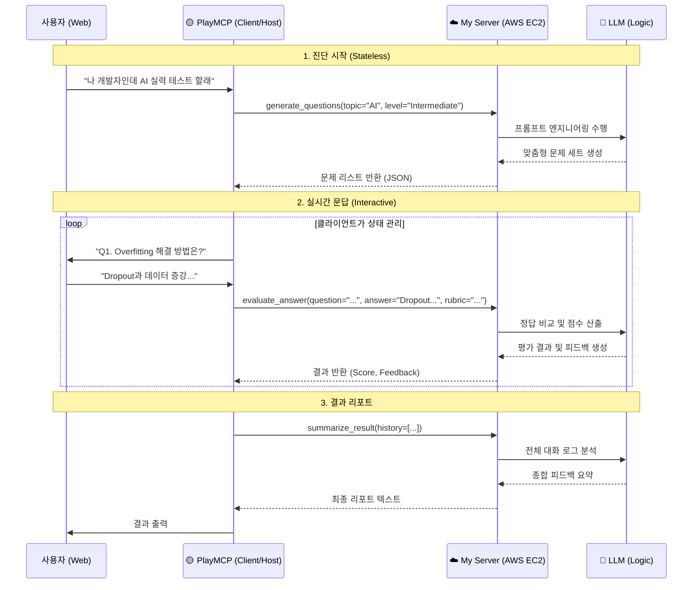

# TechTree Nexus: Kakao PlayMCP Edition

> **Target**: Kakao MCP Player 10 Contest  
> **Concept**: PlayMCP 채팅창에서 만나는 **"내 손안의 AI 기술 면접관"** (Logic-Only Version)

## 1. 아키텍처 (어떻게 연결되는가?)

본 MCP 서버는 **Stateless & Logic-Only** 아키텍처를 지향합니다.
복잡한 DB 연결이나 상태 관리는 최소화하고, **순수 AI 모델의 능력(생성, 판단, 분석)** 을 함수 형태로 제공하여 PlayMCP 클라이언트가 이를 조립해 사용할 수 있도록 합니다.

---

## 2. PlayMCP 연동 필수 조건

1.  **통신 방식**: `SSE (Server-Sent Events)` over HTTP
    *   로컬 전용(`stdio`)이 아닌 **웹 서버 모드**로 띄워야 함.
2.  **엔드포인트**:
    *   `http://{MY_PUBLIC_IP}:8000/sse` (MCP 접속 주소)
    *   `http://{MY_PUBLIC_IP}:8000/messages` (메시지 처리)
3.  **배포 환경**:
    *   **AWS EC2** (t2.micro 등) 사용.
    *   **DB 불필요**: 내부 저장소를 사용하지 않거나, 메모리 내 임시 저장만 수행.

---

## 3. 핵심 도구 (MCP Tools - Pure Logic)

이 서버는 데이터를 저장하지 않습니다. 들어온 입력을 처리하여 지능적인 출력을 반환하는 **함수형 도구**들을 제공합니다.

### 🟡 문제 생성기 (`generate_questions`)
*   **Based on**: `QAmaker Agent`
*   **설명**: 특정 주제와 난이도에 맞는 면접 질문을 즉석에서 생성합니다.
*   **입력**: `topic` (주제), `level` (난이도, Lv1~3), `count` (문제 수)
*   **출력**: 질문 리스트 (JSON)
*   **Logic**:
    *   **Lv.1 (Basic)**: 용어와 정의 중심의 기초 질문 생성.
    *   **Lv.3 (Advanced)**: 트레이드오프와 아키텍처 설계 중심의 심화 질문 생성.

### 🟡 답변 평가기 (`evaluate_answer`)
*   **Based on**: `Interviewer Agent` (Decision Step)
*   **설명**: 사용자의 답변이 현재 레벨 기준을 충족하는지 판단합니다. (실시간 흐름 제어용)
*   **입력**: `question`, `user_answer`, `level` (필수)
*   **출력**: `score`, `feedback`, `is_pass` (통과 여부), `next_action` (PASS or DEEP_DIVE)
*   **Logic (Persona)**:
    *   **Decision**: 답변이 충분하면 `PASS`, 부족하면 `DEEP_DIVE`를 반환하여 클라이언트가 다음 행동(`generate_followup` or `get_next_problem`)을 취하도록 유도합니다.
    *   **Persona**:
        *   **Lv.1**: 긍정적인 피드백 위주.
        *   **Lv.3**: 논리적 허점을 파고드는 날카로운 판단.

### 🟡 꼬리 질문 생성기 (`generate_followup`)
*   **Based on**: `Interviewer Agent` (Deep Dive Step)
*   **설명**: 답변이 부족하거나 검증이 필요할 때, 심층 질문(Deep Dive)을 생성합니다.
*   **입력**: `previous_question`, `user_answer`, `level`
*   **출력**: 꼬리 질문 텍스트 (String)
*   **Logic**:
    *   단순히 "왜요?"라고 묻는 게 아니라, 사용자의 답변에서 언급된 기술의 부작용이나 엣지 케이스를 파고듭니다.

### 🟡 종합 리포트 작성 (`summarize_result`)
*   **Based on**: `Evaluator Agent`
*   **설명**: 전체 인터뷰 기록을 입력받아 합격 여부를 포함한 최종 리포트를 작성합니다.
*   **입력**: `conversation_history`, `rubric`
*   **출력**: 종합 등급, 강점/약점 분석, 학습 가이드 (Markdown)
*   **Logic**:
    *   전체 대화의 논리적 일관성과 기술적 깊이를 평가하여 최종 점수를 산출합니다.

---

## 4. 최종 목표 (시나리오)

> **심사위원**: "나 AI 개발자 실력 테스트 해볼래."
>
> **PlayMCP (Client)**: *(내부적으로 `generate_questions` 호출)*
> **TechTree(MCP)**: *("AI", "Lv.2" 입력받아 질문 생성 후 반환)*
>
> **PlayMCP**: "첫 번째 질문입니다. **Overfitting(과적합)이 발생했을 때...**"
>
> **심사위원**: "데이터 추가, Dropout 사용..."
>
> **PlayMCP**: *(내부적으로 `evaluate_answer` 호출)*
> **TechTree(MCP)**: *("정확합니다. 점수 90점..." 반환)*
>
> ... (반복) ...
>
> **PlayMCP**: *(모든 로그를 모아서 `summarize_result` 호출)*
> **TechTree(MCP)**: *("Lv.3 실전형 엔지니어..." 리포트 작성)*
> **PlayMCP**: "수고하셨습니다! 결과는 다음과 같습니다..."

---

## 5. 개발 체크리스트

- [ ] `FastAPI` + `LangChain` 기반의 Logic Server 구축.
- [ ] **No DB**: 데이터베이스 연결 코드 제거 (Stateless).
- [ ] AWS EC2 배포 및 Public IP 설정.
- [ ] 각 Tool(`generate`, `evaluate` 등)에 대한 프롬프트 최적화.
